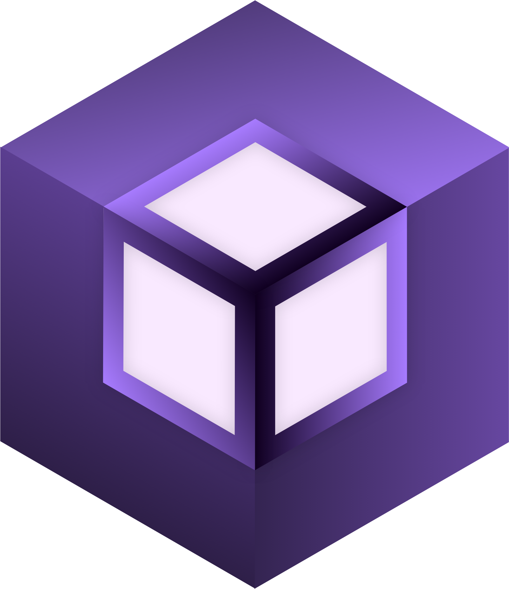

<p align="center"></p>

<h1 align="center">NeoLauncher</h1>

<em><h5 align="center">NeoLauncher est actuellement en développement. La base du launcher est basée sur Helios.</h5></em>


**Supported Platforms**


| Platform | File |
| -------- | ---- |
| Windows x64 | `NeoLauncher-setup-VERSION.exe` |
| macOS x64 | `NeoLauncher-setup-VERSION-x64.dmg` |
| macOS arm64 | `NeoLauncher-setup-VERSION-arm64.dmg` |
| Linux x64 | `NeoLauncher-setup-VERSION.AppImage` |


## Development


**System Requirements**

* [Node.js][nodejs] v20

---

**Clone and Install Dependencies**

```console


**Launch Application**

```console
> npm start
```

---

**Build Installers**


```console
> npm run dist
```

Build for a specific platform.

| Platform    | Command              |
| ----------- | -------------------- |
| Windows x64 | `npm run dist:win`   |
| macOS       | `npm run dist:mac`   |
| Linux x64   | `npm run dist:linux` |


---


[nodejs]: https://nodejs.org/en/ 'Node.js'
[vscode]: https://code.visualstudio.com/ 'Visual Studio Code'
[mainprocess]: https://electronjs.org/docs/tutorial/application-architecture#main-and-renderer-processes 'Main Process'
[rendererprocess]: https://electronjs.org/docs/tutorial/application-architecture#main-and-renderer-processes 'Renderer Process'
[chromedebugger]: https://marketplace.visualstudio.com/items?itemName=msjsdiag.debugger-for-chrome 'Debugger for Chrome'
[discord]: https://discord.gg/zNWUXdt 'Discord'
[wiki]: https://github.com/dscalzi/HeliosLauncher/wiki 'wiki'
[nebula]: https://github.com/dscalzi/Nebula 'dscalzi/Nebula'
[v2branch]: https://github.com/dscalzi/HeliosLauncher/tree/ts-refactor 'v2 branch'
